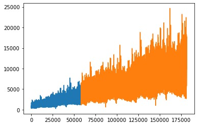

# Real-Time Experimentation (RTX)


### Description

**Real-Time Experimentation** (RTX) tool allows for self-adaptation based on analysis of real time (streaming) data.
RTX is particularly useful in analyzing operational data in a Big Data environment.

**This is a managing system for CrowdNav. The seasonality extension allows it to simulate traffic fluctuations
throughout time.**

### Traffic Generator

**FILL DATA HERE**
Takes dataset and simulates traffic for infinite amount of time
Blue is the dataset. Orange is the simulated traffic based on the dataset



### Minimal Setup

* Download the RTX code
* Run `python setup.py install` to download all dependencies
* To run example experiments, first install [CrowdNav](https://github.com/Starofall/CrowdNav)
* To use Spark as a PreProcessor you also need to install Spark and set SPARK_HOME

### Short teams guide:

This is a guide for our team so everyone can spin-up and run properly the system.
How to run the CrowdNav and RTX together properly:

#### Sumo

Install SUMO **1.14.1** and **add SUMO_HOME to PATH as it says in the guide**.

#### Kafka

Note that advertised host is localhost

```bash
docker run --name kafka --hostname kafka -p 2181:2181 -p 9092:9092 --env ADVERTISED_HOST=localhost --env ADVERTISED_PORT=9092 spotify/kafka
```

#### CrowdNav

* Git clone the CrowdNav repo ```git clone https://github.com/iliasger/CrowdNav.git```
* Install python 2.7 locally
* Create virtual environment
* Run ```python setup.py install```
* In ```app/Config.py``` set:

```python
kafkaUpdates = True
kafkaHost = "localhost:9092"
```

* Run ```run.py``` **in environment**

#### RTX

* Clone this RTX ```git clone https://github.com/fif911/CrowdNav_RTX```
* Install Python 3. (Proven to work with Python 3.9)
* run ```python setup.py install```
* run fixed version of RTX with ```python rtx.py start examples/crowdnav-seasonality```
* check the logs, ```seasonality_details.csv``` and ```results.csv```

Ensure the in ```definition.py```settings are:

```python
primary_data_provider = {
    "type": "kafka_consumer",
    "kafka_uri": "localhost:9092",
    # ...
}

change_provider = {
    "type": "kafka_producer",
    "kafka_uri": "localhost:9092",
    # ...
}
```

### Getting Started Guide

A first guide is available at
this [wiki page](https://github.com/Starofall/RTX/wiki/RTX-&-CrowdNav-Getting-Started-Guide)

### Abstractions

RTX has the following abstractions that can be implemented for any given service:

* PreProcessor - To handle Big Data volumes of data, this is used to reduce the volume
    * Example: Spark
* DataProviders - A source of data to be used in an experiment
    * Example: KafkaDataProvider, HTTPRequestDataProvider
* ChangeProviders - Communicates experiment knobs/variables to the target system
    * Example: KafkaChangeProvider, HTTPRequestChangeProvider
* ExecutionStrategy - Define the process of an experiment
    * Example: Sequential, Gauss-Process-Self-Optimizing, Linear
* ExperimentDefinition - A experiment is defined in a python file
    * See `./experiment-specification/experiment.py`

### Supported execution strategies

* ExperimentsSeq - Runs a list of experiments one after another
    ```
    experiments_seq = [
        ...
        {
            "ignore_first_n_results": 100,
            "sample_size": 100,
            "knobs": {
                "exploration_percentage": 0.0
            }
        }
        ...
    ]
    ```


* SelfOptimizer - Runs multiple experiments and tries to find the best value for the knobs
    ```
    self_optimizer = {
        # Currently only Gauss Process
        "method": "gauss_process",
        # If new changes are not instantly visible, we want to ignore some results after state changes
        "ignore_first_n_results": 1000,
        # How many samples of data to receive for one run
        "sample_size": 1000,
        # The variables to modify
        "knobs": {
            # defines a [from-to] interval that will be used by the optimizer
            "max_speed_and_length_factor": [0.5, 1.5],
            "average_edge_duration_factor": [0.5, 1.5],
        }
    }
    ```

* StepExplorer - Goes through the ranges in steps (useful for graphs/heatmaps)
    ```
    step_explorer = {
        # If new changes are not instantly visible, we want to ignore some results after state changes
        "ignore_first_n_results": 10,
        # How many samples of data to receive for one run
        "sample_size": 10,
        # The variables to modify
        "knobs": {
            # defines a [from-to] interval and step
            "exploration_percentage": ([0.0, 0.2], 0.1),
            "freshness_cut_off_value": ([100, 400], 100)
        }
    }
    ```
### Data provider
* In `KafkaConsumerDataProvider.py`, values sent from CrowdNav throught Kafka is recieved by RTX. It also provides a connection to traffic generator, which is used for generate real-world traffic data.

        try:
            self.kafka_uri = cp["kafka_uri"]
            self.topic = cp["topic"]
            self.serializer = cp["serializer"]
            info(
                "> KafkaConsumer  | " + self.serializer + " | URI: " + self.kafka_uri + " | Topic: " +
                self.topic, Fore.CYAN)
        ...
        self.consumer = KafkaConsumer(bootstrap_servers=self.kafka_uri,
                                          value_deserializer=self.serialize_function,
                                          enable_auto_commit=False,
                                          group_id=None,
                                          consumer_timeout_ms=3000)
            # subscribe to the requested topic
            self.consumer.subscribe([self.topic])

### Traffic generator
* A traffic generator is defined in `TrafficParser.py` to generate the various attributes of a real-world traffic information.

        def __init__(self, reference_mean=1000, dataset=None, minute_in_step=15, rescale_time=None, extend="Loop",
                 model="Fourier", interpolate="linear", interpolate_order=2, noiseScale=0, stream=False,
                 remove_growth=False):

### Seasonality strategy
* In `definition.py` of `crowdnav-seasonality`, Various functions are defined for seasonality analysis. The result are saved in `seasonality_details.csv`. According to the result we can find the differences between actual traffic volumes and expected volumes. As well as the differences of speeds between smart cars and normal cars.

        


                 remove_growth=False):
